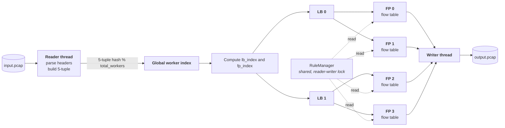

# Multithreaded Deep Packet Inspection Engine

A multithreaded DPI engine in C++17 that reads a PCAP capture, reconstructs
per-flow state, identifies the application behind each flow from its TLS SNI or
HTTP `Host` header, applies blocking rules, and writes the surviving traffic to
a new PCAP file.

It has **no external dependencies** — no libpcap, no OpenSSL, no test
framework. PCAP parsing, protocol decoding, TLS ClientHello parsing and the
thread pool are all implemented in this repository against the standard library
alone.

```bash
dpi_engine capture.pcap filtered.pcap --block-app YouTube --block-domain "*.facebook.com"
```

---

## Table of contents

- [What it does](#what-it-does)
- [What it does not do](#what-it-does-not-do)
- [Architecture](#architecture)
- [Packet-processing pipeline](#packet-processing-pipeline)
- [Five-tuple flow handling](#five-tuple-flow-handling)
- [Threading model](#threading-model)
- [Load balancing: 5-tuple hashing for flow affinity](#load-balancing-5-tuple-hashing-for-flow-affinity)
- [TLS SNI extraction](#tls-sni-extraction)
- [Application classification](#application-classification)
- [Rule-based filtering](#rule-based-filtering)
- [Output PCAP generation](#output-pcap-generation)
- [Statistics](#statistics)
- [Building](#building)
- [Usage](#usage)
- [Tests](#tests)
- [Repository layout](#repository-layout)
- [Limitations](#limitations)
- [Possible future work](#possible-future-work)

---

## What it does

| Capability | Where |
|---|---|
| Reads classic PCAP files without libpcap | [`src/core/pcap_reader.cpp`](src/core/pcap_reader.cpp) |
| Parses Ethernet → IPv4 → TCP/UDP headers | [`src/core/packet_parser.cpp`](src/core/packet_parser.cpp) |
| Extracts the SNI hostname from a TLS ClientHello | [`src/core/sni_extractor.cpp`](src/core/sni_extractor.cpp) |
| Extracts the HTTP `Host` header and DNS query names | [`src/core/sni_extractor.cpp`](src/core/sni_extractor.cpp) |
| Maps hostnames to 22 application categories | [`src/core/types.cpp`](src/core/types.cpp) |
| Tracks per-flow state in per-worker tables | [`src/engine/connection_tracker.cpp`](src/engine/connection_tracker.cpp) |
| Blocks by application, domain, source IP or port | [`src/engine/rule_manager.cpp`](src/engine/rule_manager.cpp) |
| Distributes packets across worker threads by flow hash | [`src/engine/load_balancer.cpp`](src/engine/load_balancer.cpp) |
| Inspects and filters packets on worker threads | [`src/engine/fast_path.cpp`](src/engine/fast_path.cpp) |
| Writes forwarded traffic to an output PCAP | [`src/engine/dpi_engine.cpp`](src/engine/dpi_engine.cpp) |

## What it does not do

Stated up front, because DPI is a term that invites assumptions:

- **It does not decrypt TLS.** The SNI is sent in cleartext in the ClientHello
  before encryption begins. That is the only thing read; the encrypted record
  stream is never touched.
- **It does not capture live traffic.** Input is a PCAP file read with
  `std::ifstream`. There is no NIC, no libpcap, no raw socket.
- **It does not use machine learning.** Classification is substring matching
  against a hardcoded table of domains.
- **It does not do consistent hashing.** Workers are selected with
  `hash(five_tuple) % worker_count`. See
  [below](#load-balancing-5-tuple-hashing-for-flow-affinity).
- **It does not reassemble TCP streams.** A ClientHello split across segments
  is not recovered.

This is a systems-programming project built to understand how a DPI pipeline is
structured, not a production security appliance. See
[Limitations](#limitations).

---

## Architecture



Every arrow between threads is a bounded, blocking, thread-safe queue
([`include/thread_safe_queue.h`](include/thread_safe_queue.h)): a `std::mutex`
with a `not_empty` and a `not_full` condition variable. A full queue blocks its
producer, which applies backpressure up the pipeline rather than dropping
packets or growing without bound.

The one design decision everything else follows from: **each worker owns its
flow table outright.** Because a flow always reaches the same worker, no lock is
needed to read or update flow state on the hot path.

## Packet-processing pipeline

1. **Read** — `PcapReader` validates the 24-byte global header, handles both
   endian magic numbers, and yields one `RawPacket` at a time.
2. **Parse** — `PacketParser` walks Ethernet → IPv4 → TCP/UDP, honouring the
   IPv4 IHL field and the TCP data-offset field, and bounds-checking each layer
   before reading it. Non-IPv4 and non-TCP/UDP packets are skipped.
3. **Dispatch** — the reader builds the five-tuple and hashes it to select a
   global fast-path worker.
4. **Balance** — the global worker index maps directly to a load balancer and
   its local fast-path worker queue.
5. **Inspect** — the worker looks up (or creates) the flow, updates TCP state,
   and, if the flow is not yet classified, inspects the payload for a TLS
   ClientHello, an HTTP `Host` header, or a DNS query.
6. **Decide** — the worker asks the shared `RuleManager` whether this packet
   should be dropped, and returns `FORWARD` or `DROP`.
7. **Write** — forwarded packets go to a single writer thread, which appends
   them to the output PCAP.

## Five-tuple flow handling

A flow is keyed by `(src_ip, dst_ip, src_port, dst_port, protocol)`
([`include/types.h`](include/types.h)). `FiveTupleHash` combines all five
fields with the usual `hash_combine` mixing step.

Each worker keeps an `unordered_map<FiveTuple, Connection>`. A `Connection`
carries the classification result (application and hostname), packet and byte
counters, first/last-seen timestamps, and TCP handshake state
(`NEW → ESTABLISHED → CLASSIFIED → BLOCKED/CLOSED`). Flows idle for longer than
the timeout are evicted periodically.

**Flow tracking is unidirectional.** The hash mixes source and destination
asymmetrically, so `A→B` and `B→A` are different keys and generally land on
different workers. The engine tracks each direction as its own flow. This is
asserted by [`tests/test_flow_affinity.cpp`](tests/test_flow_affinity.cpp) so
the documentation cannot quietly drift away from the behaviour.

### Flow-table management

Each fast-path worker maintains its own flow table using an
`unordered_map`. When the table reaches its configured capacity, the oldest
entry is evicted using a FIFO index.

The eviction index avoids scanning the entire flow table to find the oldest
entry, avoiding the O(n) scan previously needed to locate the oldest entry. The
indexed eviction path uses O(1) average-time hash-table removal.

## Threading model

| Thread | Count | Job |
|---|---|---|
| Reader | 1 | Read PCAP, parse headers, dispatch |
| Load balancer | `--lbs` (default 2) | Hash flows onto workers |
| Fast path (worker) | `--lbs × --fps` (default 4) | Flow tracking, DPI, rule matching |
| Output writer | 1 | Append forwarded packets to the output PCAP |

Default configuration is **8 threads**. There is no CPU pinning or NUMA
awareness.

**Shutdown is drain-based.** When the reader finishes, the engine waits until
every dispatched packet has been processed and every forwarded packet has been
written before stopping any thread. This matters: stopping a thread shuts its
queue down, and pushes to a shut-down queue are discarded, so tearing the
pipeline down early silently loses packets. The drain is verified by
[`tests/test_pipeline.cpp`](tests/test_pipeline.cpp), which asserts that the
output PCAP contains exactly as many packets as the engine reports forwarding.

## Load balancing: 5-tuple hashing for flow affinity

Worker selection uses **5-tuple hashing** to provide deterministic flow affinity.

```cpp
global_worker = FiveTupleHash{}(tuple) % total_workers;
lb_index      = global_worker / fps_per_lb;
fp_index      = global_worker % fps_per_lb;
```

The property this buys is **flow affinity**: the hash is a pure function of the
five-tuple, so every packet of a flow deterministically reaches the same
worker. That is what makes the per-worker flow tables safe to use without
locks.

This is deliberately **not** consistent hashing, and the term is avoided
throughout this repository. Consistent hashing exists to keep key placement
stable when the node count changes; here the worker count is fixed at startup,
so there is nothing to be stable across and the extra machinery would buy
nothing. It is also not rendezvous hashing. It is `hash % n`, and the honest
description is *5-tuple hashing for flow affinity*.

A consequence worth knowing: `hash % n` distributes *flows* evenly, not *bytes*.
One very large flow still lands on exactly one worker.

## TLS SNI extraction

`SNIExtractor` ([`src/core/sni_extractor.cpp`](src/core/sni_extractor.cpp))
parses the cleartext ClientHello:

```
TLS record header      content type 0x16, version, length
Handshake header       type 0x01 (ClientHello), 24-bit length
ClientHello body       version, 32-byte random,
                       session id (length-prefixed),
                       cipher suites (length-prefixed),
                       compression methods (length-prefixed),
                       extensions (length-prefixed)
  └─ extension 0x0000  server_name
       └─ name type 0x00 (host_name) → the hostname
```

Every length field is validated against the remaining buffer before it is
followed, so a truncated or hostile ClientHello cannot read out of bounds.
[`tests/test_sni_extractor.cpp`](tests/test_sni_extractor.cpp) feeds the
extractor every prefix of a valid ClientHello to exercise this.

The SNI is transmitted in cleartext — no decryption is involved, and none is
possible here. Encrypted ClientHello (ECH) traffic is not readable by this
approach.

## Application classification

Applied in order, first match wins:

1. **TLS SNI** — the hostname from the ClientHello.
2. **HTTP `Host`** — case-insensitive header scan on port 80.
3. **DNS query name** — on port 53.
4. **Port fallback** — 443 → HTTPS, 80 → HTTP.

The hostname is matched against a table of substrings in
[`src/core/types.cpp`](src/core/types.cpp) covering 22 categories (Google,
YouTube, Facebook, Instagram, Netflix, Amazon, Microsoft, Apple, WhatsApp,
Telegram, TikTok, Spotify, Zoom, Discord, GitHub, Cloudflare, Twitter/X and
the generic HTTP/HTTPS/DNS/TLS/QUIC buckets).

More specific rules are checked first: `googlevideo.com` and `yt3.ggpht.com`
classify as YouTube rather than Google, so blocking YouTube does not silently
miss most YouTube traffic. A hostname that matches nothing known still
classifies as HTTPS — we know the protocol even when we cannot name the
application.

Classification is per flow and sticky: once a flow is classified, later packets
reuse the result instead of re-inspecting.

## Rule-based filtering

Four rule types, checked in order by `RuleManager::shouldBlock`:

| Rule | Matches against |
|---|---|
| Source IP | the flow's source IPv4 address |
| Destination port | the flow's destination port |
| Application | the classified `AppType` |
| Domain | the SNI or HTTP `Host` |

Rules live behind a `std::shared_mutex`: workers take shared (read) locks on
the hot path, so rule lookups do not serialise against each other.

Rules can be given on the command line or loaded from a file
([`examples/rules.conf`](examples/rules.conf)). Blank lines are ignored, `#`
starts a comment, and a malformed entry is reported on stderr and skipped
rather than aborting the run.

**Domain matching is exact unless you use a wildcard.** `facebook.com` matches
only that exact hostname; `*.facebook.com` matches `www.facebook.com`,
`cdn.facebook.com` and the bare `facebook.com`.

**Blocking takes effect from the packet that classifies the flow.** A flow is
unclassified until its ClientHello arrives, so the preceding TCP handshake
packets are forwarded before the block engages. Once a flow is marked blocked,
every later packet in it is dropped without re-inspection.

## Output PCAP generation

The writer thread copies the input file's global header verbatim — preserving
snaplen and link type — then appends a 16-byte record header and the original
bytes for each forwarded packet. Timestamps are carried through unchanged.
The result opens in Wireshark or `tcpdump`.

**Packet order is not preserved.** Independent workers feed one writer, so
records appear in completion order rather than capture order. Timestamps are
intact, so any tool that sorts by timestamp will show the original ordering.

## Statistics

On completion the engine prints:

- **Packet counts** — total, bytes, TCP, UDP, forwarded, dropped.
- **Per-thread counts** — packets dispatched by each load balancer and
  processed by each worker, which shows how evenly the hash spread the load.
- **Flow counts** — active flows and how many were classified.
- **Application breakdown** — flows per application, with percentages.
- **Detected hostnames** — the SNI and `Host` values observed.

On the bundled sample capture (77 packets, 43 flows), 22 flows (51.2%) are
classified; the rest are short flows that carry no ClientHello, `Host` header
or DNS query to identify them.

---

## Building

Requires **CMake ≥ 3.16** and a **C++17 compiler**. Nothing else.

```bash
mkdir build
cd build
cmake ..
cmake --build .
```

On Windows with MinGW, pick the generator explicitly:

```bash
cmake -S . -B build -G "MinGW Makefiles" -DCMAKE_BUILD_TYPE=Release
cmake --build build
```

See [`docs/WINDOWS_SETUP.md`](docs/WINDOWS_SETUP.md) for Visual Studio, MSYS2,
WSL and VS Code setups.

Three executables are produced:

| Target | Purpose |
|---|---|
| `dpi_engine` | The multithreaded engine. This is the project. |
| `dpi_simple` | Single-threaded baseline with the same parsing and classification, for comparison. |
| `packet_dump` | `tcpdump`-style per-packet header dump, for debugging the parser. |

## Usage

```
dpi_engine <input.pcap> <output.pcap> [options]

  --block-ip <ip>        Block traffic from a source IPv4 address
  --block-app <name>     Block an application, e.g. YouTube
  --block-domain <dom>   Block a domain; "*.example.com" includes subdomains
  --rules <file>         Load rules from a file
  --lbs <n>              Load balancer threads (default 2)
  --fps <n>              Worker threads per load balancer (default 2)
  --verbose              More output
  --help                 Usage
```

```bash
# Classify everything, block nothing
./dpi_engine ../data/test_dpi.pcap out.pcap

# Block two applications and a source host
./dpi_engine ../data/test_dpi.pcap out.pcap \
    --block-app YouTube --block-app TikTok --block-ip 192.168.1.50

# Load rules from a file and run 16 workers
./dpi_engine capture.pcap out.pcap --rules ../examples/rules.conf --lbs 4 --fps 4
```

A sample capture is included at `data/test_dpi.pcap` (77 synthetic packets:
TLS ClientHellos for 15 well-known hostnames, HTTP requests and DNS queries).
Regenerate or extend it with:

```bash
python scripts/generate_test_pcap.py
```

## Tests

```bash
cd build
ctest --output-on-failure
```

Five executables, no external framework
([`tests/test_support.h`](tests/test_support.h) is ~60 lines):

| Test | Covers |
|---|---|
| `test_packet_parser` | Ethernet/IPv4/TCP/UDP decoding, and that truncated, ARP, IPv6 and malformed frames are rejected rather than mis-parsed |
| `test_sni_extractor` | ClientHello parsing, HTTP `Host`, DNS names, hostname→application mapping, and every truncation of a ClientHello |
| `test_flow_affinity` | Five-tuple identity and hashing; deterministic worker assignment across 1–16 workers; verifies all workers are reachable in multi-LB configurations; and verifies direction-sensitive flow mapping |
| `test_rule_manager` | All four rule types, wildcard matching, rule-file parsing with comments and malformed entries, and save/load round trip |
| `test_pipeline` | End-to-end through the real multithreaded engine: classification, blocking, output validity, drain completeness, and identical counts at 1×1, 2×2 and 4×4 workers |

## Repository layout

```
├── CMakeLists.txt
├── include/              # Public headers
├── src/
│   ├── core/             # PCAP reading, protocol parsing, SNI/Host/DNS extraction
│   ├── engine/           # Load balancers, workers, flow tables, rules, orchestrator
│   └── main.cpp          # CLI entry point
├── tools/
│   ├── dpi_simple.cpp    # Single-threaded baseline
│   └── packet_dump.cpp   # Packet header dumper
├── tests/                # Test suite (CTest)
├── data/test_dpi.pcap    # Sample capture
├── examples/rules.conf   # Example rule file
├── scripts/              # Test-data generator
└── docs/
    ├── ARCHITECTURE.md   # Detailed walkthrough of the design
    └── WINDOWS_SETUP.md  # Toolchain setup on Windows
```

## Limitations

Known and deliberate:

- **Offline only.** PCAP files in, PCAP file out. No live capture.
- **Classic PCAP only.** PCAPNG (modern Wireshark's default format) is not
  supported. Byte-swapped captures are read correctly but the output file
  written from one is not valid — the global header is copied verbatim while
  record headers are written in host order.
- **IPv4 only.** IPv6 packets are parsed at the Ethernet layer and then skipped.
- **Ethernet only.** Other link types are not decoded.
- **No TCP reassembly.** A ClientHello spanning multiple segments is missed.
- **Unidirectional flows.** The two directions of a connection are separate
  flows on possibly different workers, so per-flow inbound/outbound byte
  counters are not populated.
- **Output is unordered.** Records appear in completion order, not capture
  order. Timestamps are preserved.
- **Classification is substring matching.** It is trivially evaded by a
  hostname not in the table, and blind to ECH and to QUIC.
- **No throughput or latency figures are published here,** because none have
  been measured. The engine has been verified for correctness, not benchmarked.

## Possible future work

- TCP segment reassembly, so ClientHellos spanning segments are recovered.
- Bidirectional flow tracking via a direction-normalised tuple key.
- PCAPNG input, and correcting the output header for byte-swapped captures.
- IPv6 support.
- Optional timestamp-ordered output.
- A benchmark harness, so performance claims could be made from measurements.

## License

MIT — see [LICENSE](LICENSE).
